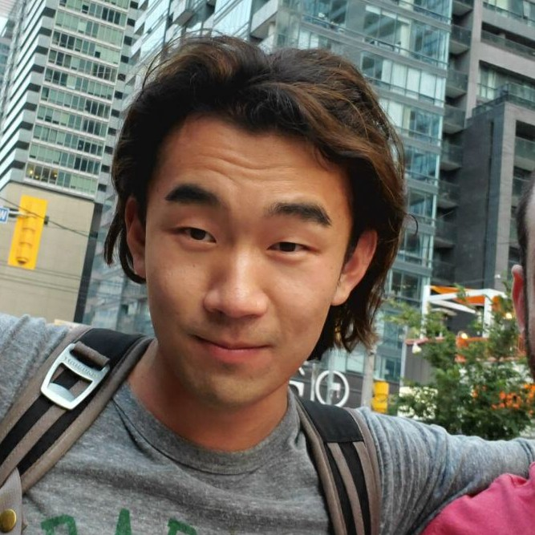

Hello, I am a fourth year math graduate student at Colorado State University.

In my past life, I was a [software engineer](https://www.linkedin.com/in/cl587/) at [Coursera](https://www.coursera.org/), helping to make education accessible to all.

# Personal

I grew up in the frozen tundra of Calgary, Alberta. Then I worked in Silicon Valley up in the San Francisco Bay Area for 6 years prior to coming to graduate school for mathematics.

Outside of math, I like to drink coffee, play hockey, ski, bike, and run (trail and road). I also enjoy playing and studying poker theory.

# Writing

Most of my writing are not publically available, but throughout the years, some have been published on Coursera's tech blog.

* [Categorizing learning content From hand-coded to an algorithmic approach](https://medium.com/coursera-engineering/data-driven-content-categorization-89de0104bcbd)
* [The Evolution of Coursera Search: Enabling Product Innovation Through Technical Innovation](https://medium.com/coursera-engineering/the-evolution-of-coursera-search-enabling-product-innovation-through-technical-innovation-6658617cc330)
* [Webpack 3 to 4: Facing the known unknowns and unknown unknowns](https://medium.com/coursera-engineering/webpack-3-to-4-facing-the-known-unknowns-and-unknown-unknowns-cdfeb817faf8)
* [An engineer’s perspective on engineering and data science collaboration for data products](https://medium.com/coursera-engineering/an-engineers-perspective-on-engineering-and-data-science-collaboration-for-data-products-84cf9b38cd52)
* [How Amazon CodeGuru Profiler helps Coursera create high-quality online learning experiences](https://aws.amazon.com/blogs/devops/coursera-codeguru-profiler/)
* [Getting Started with Amazon Redshift](https://www.slideshare.net/AmazonWebServices/getting-started-with-amazon-redshift-64031564)
* [Coursera boosts search speed tenfold](https://resources.algolia.com/customer-stories/coursera)

# Presentations

* [Fast Solutions to Simultaneous Sylvester Systems](https://slides.com/chrisliu/quicksylver-taga24) - As part of the [Tensors Algebra-Geometry-Applications 2024](https://thetensor.space/events/TAGA-2024) conference, I [presented](https://thetensor.space/events/TAGA24-Conference-Resources#chris-liu) on an algorithm for solving tensor equations.

* [Quick solvers for endomorphisms of modules.](https://thetensor.space/events/GNT-2023#chris-liu) - As part of the [Groups, Nilpotence, and Tensors 2023](https://thetensor.space/events/GNT-2023) conference, I presented on ideas to solve Simultaneous Sylvester Systems - systems of matrix equations of the form XA_i + B_iY = C_i.
* [The big tent of functional programming
](https://docs.google.com/presentation/d/1Azr5Cn7AoQ1DVeRxS_56a8qEUIDSt4JtiXUqiTN_eSU/edit#slide=id.p)  - As part of the [Applied Category Theory Seminar](https://csu-applied-category-theory.github.io) at Colorado State University, I presented on the core idea behind functional programming - using types and data flow to program.
* [Option Data Type](https://docs.google.com/presentation/d/15ujgShfHwgQxYQYe3wx-lozlKmhUAKKmj3b6wMf_hMI/edit#slide=id.p)  - As part of the [Applied Category Theory Seminar](https://csu-applied-category-theory.github.io) at Colorado State University, I presented on the Option data type in Scala, a commonly used monad in functional programming that allows for composing failable operations.
* [Dependent Types with Pie](https://www.youtube.com/watch?v=48lio_3FhAo) - As part of the [Applied Category Theory Seminar](https://csu-applied-category-theory.github.io) at Colorado State University, I presented on the dependent type programming language Pie.
* [Kan Condition for Simplicial Sets](https://www.youtube.com/watch?v=HVYsL8NJKtw) - As part of the ACATs seminar, I presented on how to compute with simplicial sets, a generalization of simplicies, which themselves generalize triangles. In particular, unwrapping the category theoretical definitions and the strong/weak Kan conditions to understand how they provide a useful model for higher categories.
* [ACM/ACM-W at CSU](https://www.cs.colostate.edu/~acm/) presentation - I presented to the ACM (Association for Computing Machinery) and ACM-Women groups at Colorado State University about interviewing for a technical position, drawing on my previous experiences as an interviewer and designer of interviewing questions.

# Teaching

* SP22 - Math 160: Calculus for Physical Scientists I
* FA22 - Math 101: Math in the Social Sciences
* SP23 - Math 101: Math in the Social Sciences
* FA23 - Grad TA for Math 560: Linear Algebra
* SP24 - Math 155: Calculus for Biological Scientists

# Papers

Hopefully in due time :)

